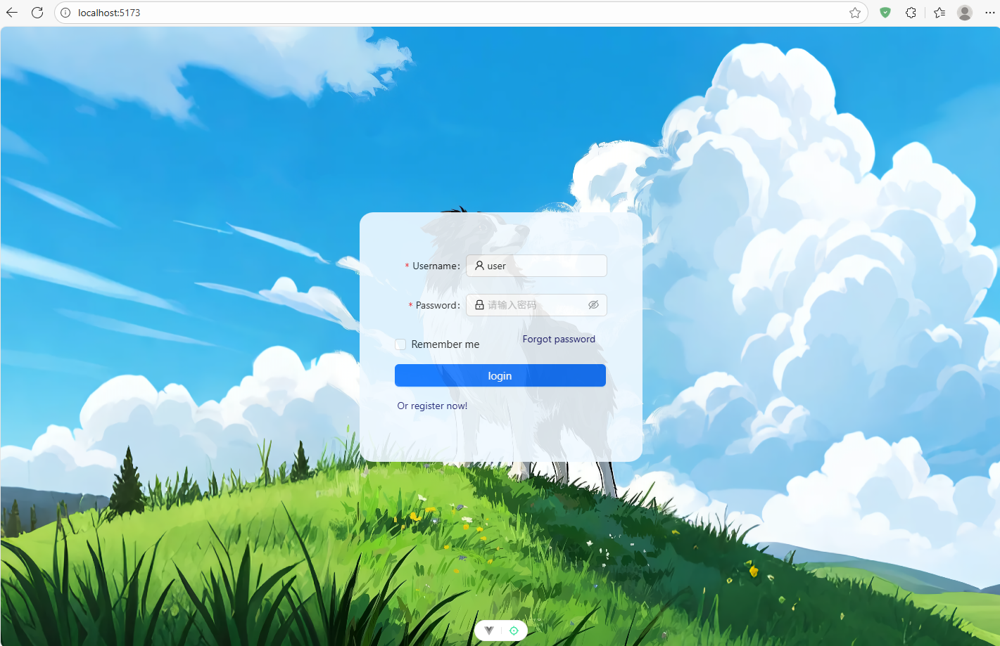
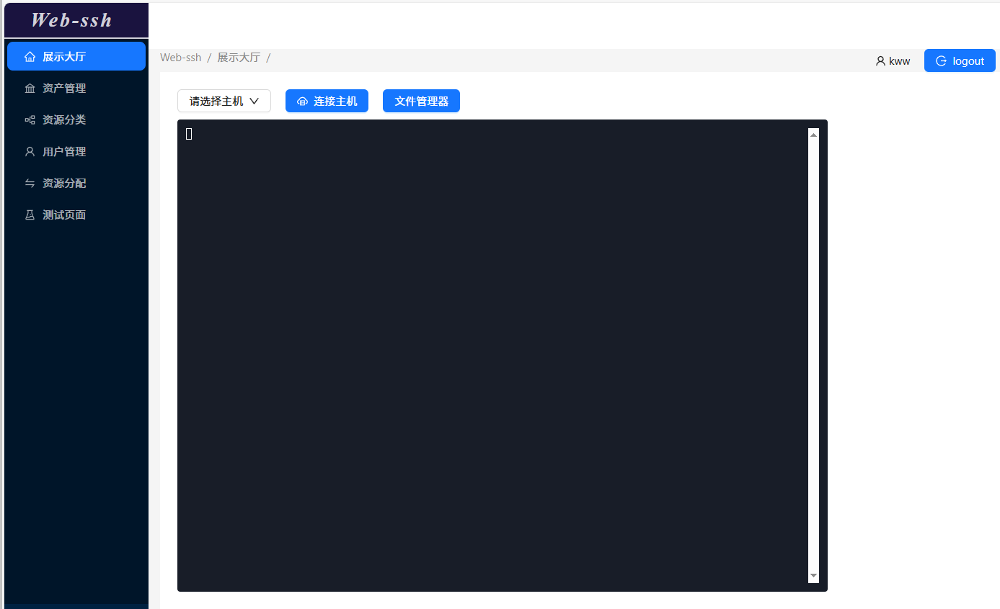

# 🚀 具有鉴权机制的 web_ssh

## ⚡ 技术栈

- 前端

```
vue3
vite
ant-design-vue
router
axios
```

- 后端

```
django
channels
djangorestframework
djangorestframework_simplejwt
paramiko
```

___

### 使用说明

#### 🐳 前置条件

- 没有安装docker，使用本地数据库与内存缓存，在django配置文件中修改
- 安装docker，使用mysql与redis，无需修改，只需要在docker-compose中运行对应容器

如果操作系统为Window，请下载WSL (version>2.6)

```bash
确保系统版本 ≥ 19041 且已启用“虚拟机平台”功能（控制面板 → 启用或关闭 Windows 功能）。

管理员 PowerShell：
wsl --install          # 若此前完全没装过 WSL，会连带装 Ubuntu，可后面再卸

设 WSL2 为默认：
wsl --set-default-version 2

强制拉到最新内核：
wsl --update --web-download      # 关键参数，不走 Store 缓存，直接在github下 2.6.x msi 
```

安装 Docker或 Docker Desktop ，自行去官网下载

用docker-compose启动对应服务容器，本项目需要mysql，redis，ubuntu容器

```bash
cd docker/build
# 创建镜像
docker build -t ubuntu-ssh:latest .
# 启动容器
docker compose up -d
```

安装Node.js，前端构建项目需要，自行去官网下载

___

#### 🖥️ 前端服务部署

初始化前端

```bash
cd frontend
npm install # 安装前端依赖包
```

启动前端开发服务器(终端1)

```bash
npm run dev
```

#### 💻 后端服务部署

初始化后端


```bash
cd backend
pip install -r requirements.txt # 安装后端依赖包(需要先安装python)
```

数据迁移(建表)

```bash
cd web_ssh/backend
# 生成数据迁移文件
python manage.py makemigrations
# 数据迁移
python manage.py migrate 
```

创建管理员账户，这是进入平台的唯一账户

```bash
python manage.py createsuperuser
```

启动后端服务器(终端2)

```bash
python manage.py runserver
```

进入管理员页面

```bash
http://127.0.0.1:8000/admin
```

____

其他说明：

配置MySQL数据库

如果有在中docker中部署mysql，则不需要(已经配置好了)。

自行安装(不通过该项目docker-compose)的mysql，请检查配置中的基本连接下的连接参数是否和自己设置的mysql连接匹配。

```python
# 数据库
DATABASES = {
    'default': {
        # 1. 驱动
        'ENGINE': 'django.db.backends.mysql',

        # 2. 基本连接
        'NAME': os.getenv('DB_NAME', 'web_ssh'),          # 提前 CREATE DATABASE
        'USER': os.getenv('DB_USER', 'root'),
        'PASSWORD': os.getenv('DB_PASSWORD', '123456'),
        'HOST': os.getenv('DB_HOST', '127.0.0.1'),
        'PORT': os.getenv('DB_PORT', '3306'),

        # 3. 连接池（Django 3.2+ 支持 CONN_MAX_AGE）
        'CONN_MAX_AGE': 600,                      # 秒：复用连接 10 min
        'CONN_HEALTH_CHECKS': True,               # Django 5.0+ 心跳检测

        # 4. 客户端选项
        'OPTIONS': {
            'charset': 'utf8mb4',
            'use_unicode': True,
            'init_command': "SET "
                            "sql_mode='STRICT_TRANS_TABLES,ERROR_FOR_DIVISION_BY_ZERO,NO_ENGINE_SUBSTITUTION', "
                            "time_zone='+00:00'",   # UTC 时区，与 Django USE_TZ 一致
            'isolation_level': 'read committed',   # 避免脏读
        },
    }
}
```

如果没有下载Mysql，请注释掉该部分代码，在backend/src/settings/base.py中已配置好sqlite数据库，无需安装

```python
DATABASES = {
    'default': {
        'ENGINE': 'django.db.backends.sqlite3',
        'NAME': BASE_DIR / 'db.sqlite3',
    }
}
```

配置channel缓存层

如果有安装Redis服务，同样无需操作，自行安装(不通过该项目docker-compose)的redis，请检查配置中的的连接参数是否和自己设置的redis连接匹配

```python
CHANNEL_LAYERS = {
    "default": {
        "BACKEND": "channels_redis.core.RedisChannelLayer",
        "CONFIG": {
            "hosts": ["redis://:123456@127.0.0.1:6379/0"],   # 默认库 0
            "capacity": 1500,      # 单通道最大消息积压
            "expiry": 10,          # 消息过期秒数
        },
    }
}
```

如果没有下载Redis，请注释掉该部分代码，并在backend/src/settings/dev.py中取消注释

```python
CHANNEL_LAYERS = {
    "default": {
        "BACKEND": "channels.layers.InMemoryChannelLayer"
    }
}
```

#### ✅ 启动项目

先检查在终端1和终端2服务已经顺利启动

终端1

```bash
(env) PS <install path>\web-ssh\frontend> npm run dev

> frontend@0.0.0 dev
> vite


  VITE v7.2.4  ready in 6937 ms

  ➜  Local:   http://localhost:5173/
  ➜  Network: use --host to expose
  ➜  Vue DevTools: Open http://localhost:5173/__devtools__/ as a separate window
  ➜  Vue DevTools: Press Alt(⌥)+Shift(⇧)+D in App to toggle the Vue DevTools
  ➜  press h + enter to show help
```

终端2

```bash
(env) PS <install path>\web-ssh\backend> python manage.py runserver
Watching for file changes with StatReloader
2025-11-30 00:56:50 | INFO | django.utils.autoreload:667 | Watching for file changes with StatReloader
Performing system checks...

System check identified no issues (0 silenced).
November 30, 2025 - 00:56:50
Django version 4.2.24, using settings 'src.settings.dev'
Starting ASGI/Daphne version 4.2.1 development server at http://127.0.0.1:8000/
Quit the server with CTRL-BREAK.
```

浏览器访问前端入口 http://localhost:5173/



输入创建的超级管理员账户与密码，点击登陆，进入平台



____

### 内容概述

- 在用户管理中创建新用户，并设置权限
- 在资源分配中新增主机类型
- 在资产管理中新增ssh连接主机，这里可以是docker-compose部署的四个ubuntu容器，也可以是任何可以连接到的ssh服务器
- 在资源分配中给指定用户分配主机资源
- 在展示大厅中进入ssh服务器，并执行相关指令，或者使用文件管理器部署应用程序

### 后续功能待开发

- 实现ssh服务器的批量运行sh文件，这里只是和一台进行交互

- 实现用户功能改善，例如实现用户头像信息的设置
- 实现定时任务，可以在指定时间运行指定脚本

### 免责声明

本项目为学习项目，仅供学习交流，禁止商用或其他目的的使用。如果因不合理的操作而造成的任何财产损失，本项目概不负责。
